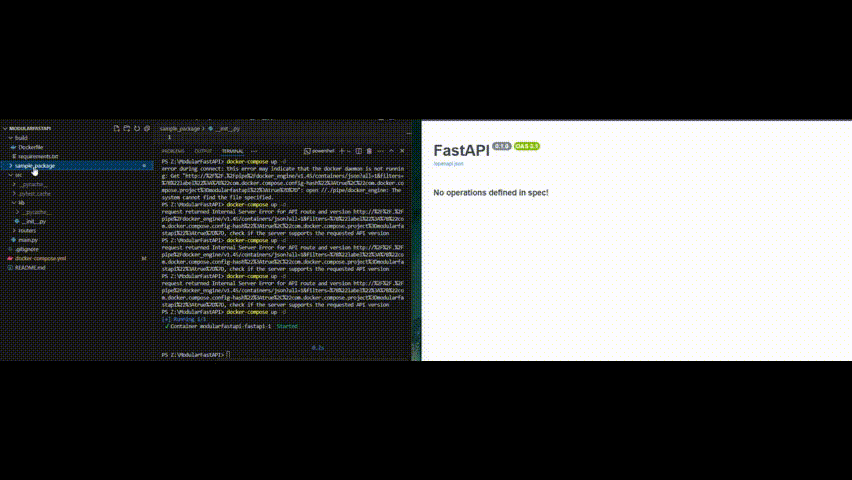

# ModularFastAPI
Template for deploying a FastAPI service with modular plugin support

The purpose of this project is more-or-less to have a modularity-enabled FastAPI template that I can use for my projects.

A concept I made from the [StableDiffusionAPI](https://github.com/AlexScotland/StableDiffusionAPI), this template allows developers to keep functionality separated from the base API.

This allows us to test thoroughly, and treat our API endpoints more like packages - where we can drag and drop API packages into the code base.

 

# Dependencies
- nvidia-docker2

# TODO:
- [x] Create a dynamic installation for all requirements within the plugins
- [ ] Better testing
- [x] Dynamically typed router imports